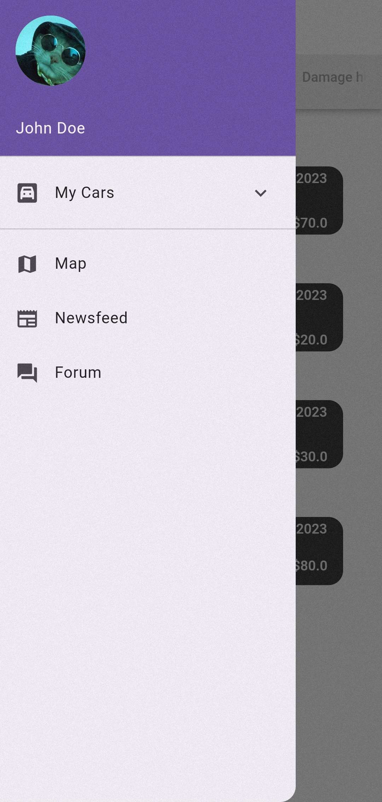
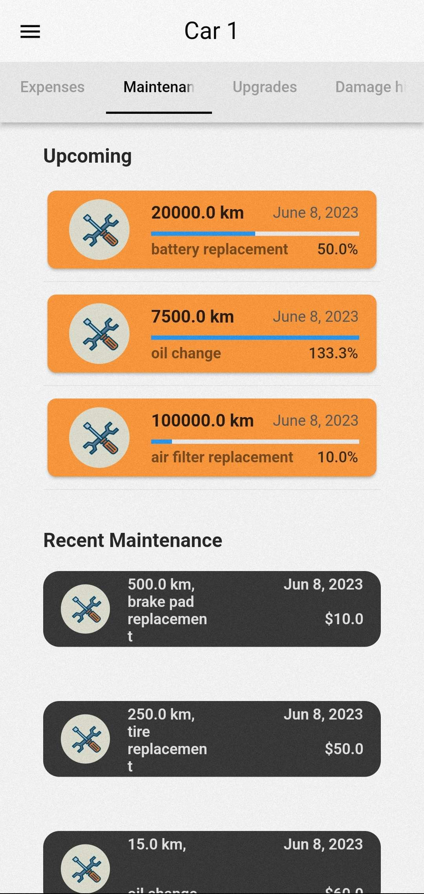

<!-- PROJECT LOGO -->
 

  

  <h3 align="center">Maintena</h3>

  

    An awesome car maintenance app that does not make coffee!
     
<!--     <a href="https://github.com/othneildrew/Best-README-Template"><strong>Explore the docs »</strong></a>
      -->
     
    <a href="https://github.com/basilis0606/MainTena/releases">View Demo</a>
    ·
    <a href="https://github.com/basilis0606/MainTena//issues">Report Bug</a>
    ·
    <a href="https://github.com/basilis0606/MainTena//issues">Request Feature</a>
  

<!-- ABOUT THE PROJECT -->
## About The Project

    
    &nbsp;&nbsp;&nbsp;&nbsp;&nbsp;&nbsp;&nbsp;&nbsp;&nbsp;&nbsp;&nbsp;&nbsp;&nbsp;&nbsp;
    

Maintena is a user-friendly application that aims to make vehicle maintenance easier for drivers.  
Each vehicle has a service manual from the manufacturer
which states which, how often and how the vehicle should be serviced.
vehicle.  
Maintena provides an easy-to-use solution that helps drivers to
and maintain the longevity of their vehicle and the
smooth operation. 

Features:
* Maintenance reminders
* Expenses tracking
* Performance upgrades
* Damage history
* Community Discussion

### Built With

* [![Dart][Dart-ico]][Dart-url]
* [![Flutter][Flutter-ico]][Flutter-url]

<!-- GETTING STARTED -->
## Getting Started

Just download the app from the [releases](https://github.com/basilis0606/MainTena/releases)

<!-- MARKDOWN LINKS & IMAGES -->
<!-- https://www.markdownguide.org/basic-syntax/#reference-style-links -->
[Flutter-url]: https://flutter.dev/
[Flutter-ico]: https://img.shields.io/badge/Flutter-%2302569B.svg?style=for-the-badge&logo=Flutter&logoColor=white
[Dart-ico]: https://img.shields.io/badge/dart-%230175C2.svg?style=for-the-badge&logo=dart&logoColor=white
[Dart-url]: https://dart.dev/
[product-screenshot]: docs/Project-description/assets/Screenshots\IMG_20230608_191847.jpg
